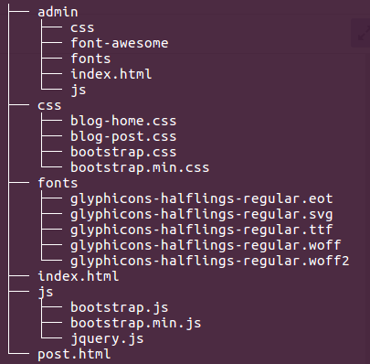

## Turning on some important features

Check some settings in your php.ini file.
- display_errors: On
- output_buffering: 4096
Then restart your server.

## Adding assets & setting structures
This lecture actually skipped all the html, css and bootstrap, because they are another programming area, not the parts of PHP.
1. Download CMS_TEMPLATE.zip, unzip the file.
The initial structure of CMS_TEMPLATE is as below.
```shell
$ tree -L 2
```


2. Make **_images_** directory in the template root directory.
3. Move to admin directory, make another **_images_** directory 
   Then Move to the root directory, again.
4. Change the file names **_.html_** -> **_.php._**

## Make a database

```sql
(connected as root)
CREATE DATABASE IF NOT EXISTS cms;
GRANT ALL PRIVILEGES on cms.* to **_username_**@localhost with GRANT OPTION;
FLUSH PRIVILEGES;

CREATE TABLE category (
    cat_id TINYINT(3) NOT NULL AUTO_INCREMENT PRIMARY KEY
   ,cat_title VARCHAR(255) NOT NULL
);

MariaDB [cms]> explain category;
+-----------+--------------+------+-----+---------+----------------+
| Field     | Type         | Null | Key | Default | Extra          |
+-----------+--------------+------+-----+---------+----------------+
| cat_id    | tinyint(3)   | NO   | PRI | NULL    | auto_increment |
| cat_title | varchar(255) | NO   |     | NULL    |                |
+-----------+--------------+------+-----+---------+----------------+
```

## Connect to the database (easy way)

1. Make a directory **_includes_**
2. Write a file **_db.php_**

This is an easy way to connect to the database.
```php
$connection = mysqli_connect ('localhost', '{your username}', '{your password}', 'cms');
if ($connection) {
echo "we are connected";
}
```

## Connect to the database (secure way)
This is a very secure way to connect to the database.
1. Put all the infomations into an array.

```php
$db['db_host'] = "localhost";
$db['db_user'] = "{your username}";
$db['db_pass'] = "{your password}";
$db['db_name'] = "cms";
```
2. Make them constatns via strtoupper and define function.
```php
foreach ($db as $key => $value) {
  define (strtoupper ($key), $value); 
}
```
3. Now you can change the previous values like this.
```php
Easy way:
$connection = mysqli_connect ('localhost', '{username}', '{password}', 'cms');
```
```php
Secure way:
$connection = mysqli_connect (DB_HOST, DB_USER, DB_PASS, DB_NAME);
```

## Make files reuseable

1. Divide codes into **_header.php_**, **_footer.php_** from index.php
2. Take **_navigation_** parts out to **_navigation.php_** file.
3. Take **_side bar_** parts out to **_sideabar.php_** file.
4. You must include the new created files to index.php
5. We are going to make the contents dynamically, so we only need a first post part.

(※ Though the instructor said to delete it, I decided to left the **_pager_** part.)

## Insert data into categories table and display

1. Change the table name **_category_** --> **_categories_**
```sql
MariaDB [cms]> RENAME TABLE category TO categories;
```

2. Insert values into title 'bootstrap','javascript' for test.
```sql
MariaDB [cms]> insert into categories (cat_title) values ('bootstrap');
MariaDB [cms]> insert into categories (cat_title) values ('javascript');
```

3. Open **_navigation.php_**, modify the menu part.
4. write the query parts to display the category titles.
```php
$query = "SELECT * FROM categories";
$select_all_categories_query = mysqli_query ($connection, $query);

while ($row = mysqli_fetch_assoc ($select_all_categories_query)) {
  $cat_title = $row['cat_title'];
  echo "<li><a href='#'>{$cat_title}</a></li>";
}
```
Do not worry about these codes, we are gonna refactoring them later. 

5. Make sure including **_db.php_** file to index.php.

## Creating posts table

1. Create another table **_posts_**
```sql

CREATE TABLE posts (
    post_id INT(3) NOT NULL AUTO_INCREMENT PRIMARY KEY
    ,post_category_id INT(3) NOT NULL
    ,post_title VARCHAR(255) NOT NULL
    ,post_author VARCHAR(255) NOT NULL
    ,post_date DATETIME NOT NULL
    ,post_image TEXT
    ,post_content TEXT
    ,post_tags VARCHAR(255) NOT NULL
    ,post_comment_count INT(11) NOT NULL
    ,post_status VARCHAR(255) NOT NULL DEFAULT 'draft'
);

MariaDB [cms]> explain posts;
+--------------------+--------------+------+-----+---------+----------------+
| Field              | Type         | Null | Key | Default | Extra          |
+--------------------+--------------+------+-----+---------+----------------+
| post_id            | int(3)       | NO   | PRI | NULL    | auto_increment |
| post_category_id   | int(3)       | NO   |     | NULL    |                |
| post_title         | varchar(255) | NO   |     | NULL    |                |
| post_author        | varchar(255) | NO   |     | NULL    |                |
| post_date          | datetime     | NO   |     | NULL    |                |
| post_image         | text         | YES  |     | NULL    |                |
| post_content       | text         | YES  |     | NULL    |                |
| post_tags          | varchar(255) | NO   |     | NULL    |                |
| post_comment_count | int(11)      | NO   |     | NULL    |                |
| post_status        | varchar(255) | NO   |     | draft   |                |
+--------------------+--------------+------+-----+---------+----------------+
```

## Insert data into the posts table and display

1. Insert datas

```sql
INSERT INTO POSTS (post_category_id, post_title, post_author, post_date, post_content, post_tags) VALUES
(1, 'This is the first post', 'jiwon', now(), 'This is the first post in cms blog.', 'php,javascript');

INSERT INTO POSTS (post_category_id, post_title, post_author, post_date, post_content, post_tags) VALUES
(2, 'This is the second post', 'jiwon', now(), 'This is the second post in cms blog.', 'php,cms');
```
2. Insert images

## Create custom search engine

1. Add **_search form_** to **_sidabar.php_**
```html
   <!-- Search form -->
   <form action="search.php" method="post">

   <div class="input-group">

       <input class="form-control" name="search" type="text">
       <span class="input-group-btn">

           <button class="btn btn-default" name="submit" type="submit">

               <span class="glyphicon glyphicon-search"></span>
       </button>
       </span>
   </div>
   <!-- /.input-group -->
   </form>
```

2. Copy **_index.php_** to **_search.php_** and modify posts part
```html
            <!-- Blog Entries Column -->
            <div class="col-md-8">
<?php
if (isset ($_POST['submit'])) {
  $search = $_POST['search'];

  $query = "SELECT * FROM posts WHERE post_tags LIKE '%$search%'";
  $search_query = mysqli_query ($connection, $query);

  if (!$search_query) {
    die ("QUERY FAILED". mysqli_error ($connection));
  }

  $count = mysqli_num_rows ($search_query);

  if ($count == 0) {
    echo "<h1> NO RESULT </h1>";
  } else {

    while ($row = mysqli_fetch_assoc ($search_query)) {
      $post_title   = $row['post_title'];
      $post_author  = $row['post_author'];
      $post_date    = $row['post_date'];
      $post_image   = $row['post_image'];
      $post_content = $row['post_content'];
?>

 <h1 class="page-header">
     Page Heading
     <small>Secondary Text</small>
 </h1>

 ....< skip >
```
If 'submit' value sends from **_sidebar.php_**, it stores as $search.
Then $query makes a search query statement.
If there are no results, the echo works printing 'No result'.
If there is any result, it fetches and makes $post variables and displays.

## Adding categories to the sidebar

1. Copy php codes from **_navigation.php_**, paste them to **_sidabar.php_**.
   Just add below codes inside of <ul></ul> tags.

```html
<?php

$query = "SELECT * FROM categories";
$select_all_categories_query = mysqli_query ($connection, $query);

while ($row = mysqli_fetch_assoc ($select_all_categories_query)) {
  $cat_title = $row['cat_title'];

    echo "<li><a href='#'>{$cat_title}</a></li>";
}

?>
```
You can also display limit you want, by add 'LIMIT number' to the query.
```html
$query = "SELECT * FROM categories LIMIT 3";
```
This will display only 3 categories.

2. Modify part **_widget.php_**

Take the widget parts to a new php file named **_widget.php_**.
Do not forget including the **_widget.php_** in the place.

3. (Optional) Take the remained categories parts out in **_sidebar.php_**

There are another 'col-lg-6' parts remained right now.
```html
                        <!-- /.col-lg-6 -->
                        <div class="col-lg-6">
                            <ul class="list-unstyled">
                                <li><a href="#">Category Name</a>
                                </li>
                                <li><a href="#">Category Name</a>
                                </li>
                                <li><a href="#">Category Name</a>
                                </li>
                                <li><a href="#">Category Name</a>
                                </li>
                            </ul>
                        </div>
                        <!-- /.col-lg-6 -->
```
If you cut the part out, you can modify our category part's class name, 
'col-lg-6' to 'col-lg-12'. Since the part we cut out had been '6', 
now you can use the whole '12'.

